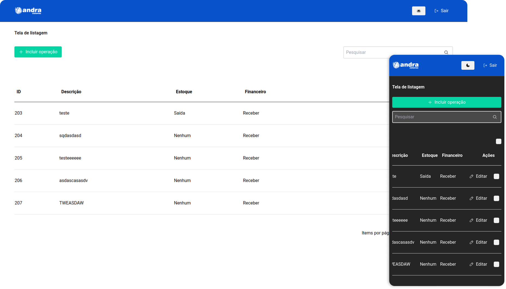

<div id="top"></div>

<div align="center">
   <a href="#">
       
  </a>
   <a href="#">
          
   </a>
   <a href="#">
     
   </a> 
   <a href="#">
      
   </a>
   <a href="https://www.linkedin.com/in/marcos-antonio-579370160/" target="_blank">
      
    </a>
</div>
<br/>
 
<!-- TABLE OF CONTENTS -->
<details>
  <summary>Tabela de conteudos</summary>
  <ol>
    <li>
      <a href="#sobre-o-projeto">Sobre o projeto</a> 
    </li>
    <li><a href="#features">Features</a></li> 
    <li>
      <a href="#getting-started">Getting Started</a> 
    </li>  
    <li><a href="#feito-com">Feito com</a></li>
    <li><a href="#contato">Contato</a></li> 
    <li><a href="#license">Lisence</a></li> 
  </ol>
</details>

<!-- SOBRE O PROJETO -->

## Sobre o projeto

<a href="https://andra.vercel.app/" target="_blank">
  
</a> 

Andra é um sistema proposto pela empresa Andra!

  
### Tomei a liberdade de alterar algumas coisas para demonstrar melhor o meu conhecimento, ao invés de usar uma lib criar os meus próprios componentes e alterar o design dado inicialmente! 
  
A proposta consiste em implementar uma aplicação web utilizando o framework NextJS que terá como finalidade desenvolver um CRUD (Create, Read, Update, Delete) para naturezas da operação.

Sua aplicação deverá possuir:

- CRUD de naturezas da operação:
  - Criar, alterar, excluir e pesquisar naturezas da operação.
  - Implementar validações de campos obrigatórios e tipos de dados conforme documentação da API.
- Grade de pesquisa:
  - Deve ser ordenável por qualquer coluna, e possuir paginação de 20 itens.
<br>
<a href="https://noemia.vercel.app/" target="_blank">
  Teste você mesmo!
</a>

  
<p align="right">(<a href="#top">back to top</a>)</p>


<!-- FEATURES -->

## Features

- [x] Criação, Edição e Delete das naturezas da operação 
- [x] Página inicial com a listagem
- [x] Paginação da listagem
- [x] Eclusão em lotes 
- [x] Inclusão em lotes
- [x] Dark theme
- [x] PWA

<p align="right">(<a href="#top">back to top</a>)</p>


<!-- GETTING STARTED -->

## Getting Started

### Instalação e rodando localmente
 
1. Clone o repositório
   ```bash
   
   git clone git@github.com:Marcos-An/andra.git || https://github.com/Marcos-An/andra.git
   
   ```
2. Instale yarn/npm pacotes
   ```bash
   
   yarn || npm install 
   
   ```
3. Renomeie `.env.local.example` apra `.env.local` e complete as variaveis:
   ```bash
    NEXT_PUBLIC_API_URL=
    NEXT_PUBLIC_API_SECRET_KEY=
   ```
   

<p align="right">(<a href="#top">back to top</a>)</p>
 

<!-- FEITO COM -->

## Feito com

-   [React](https://pt-br.reactjs.org/)
-   [Next.js](https://nextjs.org/)
-   [Vercel](https://vercel.com) 
-   [TailWind](https://tailwindcss.com) 
-   [HeadlessUI](https://headlessui.com/)


<!-- CONTATO -->

## Contato
<a href="https://www.linkedin.com/in/marcos-antonio-579370160/" target="_blank">
  
  <p>Marcos Silva</p>
</a>
<br /> 
<div >
     <a href="https://www.linkedin.com/in/marcos-antonio-579370160/" target="_blank">
      
    </a>
   <a href="mailto:marcos.silva.0556@gmail.com" target="_blank">
      
    </a>

</div> 

<!-- LICENSE -->

## License

Distributed under the MIT License. See <a href="https://github.com/Marcos-An/noemia/blob/main/LICENSE" target="_blank"> MIT </a> for more information.

<p align="right">(<a href="#top">back to top</a>)</p>


